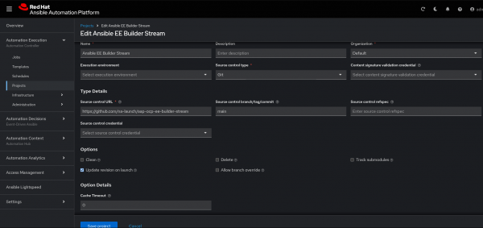
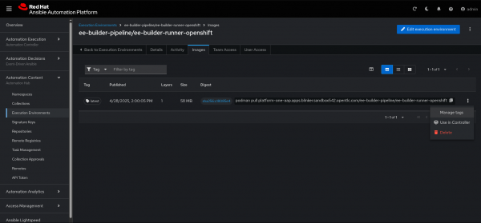
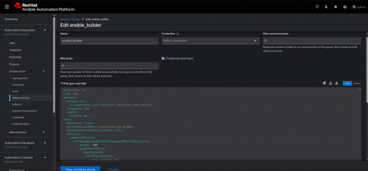
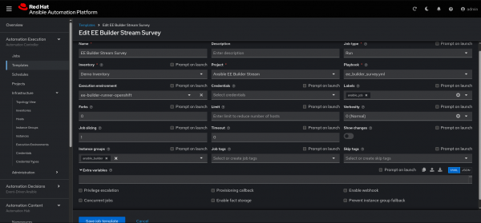
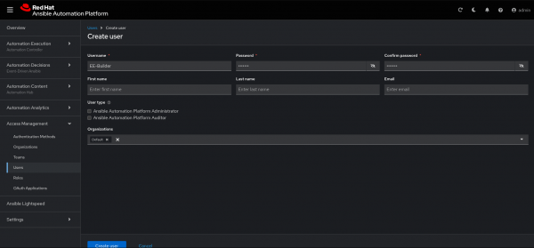
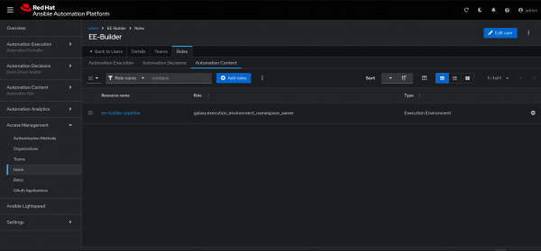
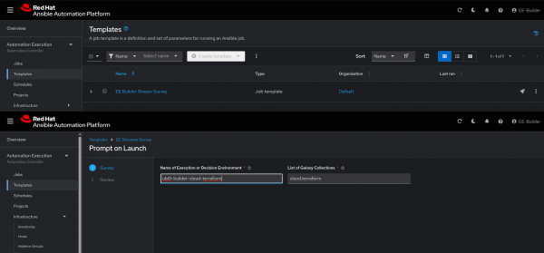
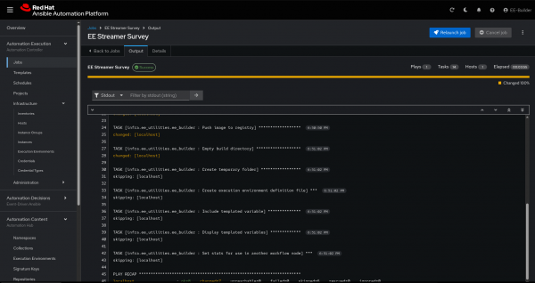
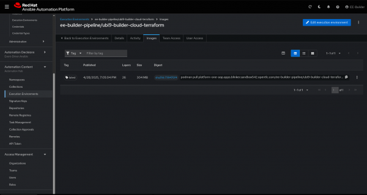

# EE Builder with Ansible Automation Platform on OpenShift

**Date:** July 10, 2025  
**Authors:** [Chris Peters](/author/chris-peters), [Brady Thompson](/author/brady-thompson)
**Original Doc:** https://developers.redhat.com/articles/2025/07/10/ee-builder-ansible-automation-platform-openshift#
---

The core component in the execution of Ansible Playbooks within [Red Hat Ansible Automation Platform](https://developers.redhat.com/products/ansible/overview) is the execution environment. These execution environments bundle together various collections required for [automation](https://developers.redhat.com/topics/automation) across multiple domains and targets. Effectively managing the lifecycle of these environments is an important process in the overall operationalization of Ansible Automation Platform.

## Process Overview

Currently, whether you install Ansible Automation Platform on bare metal, virtual machines, or [Red Hat OpenShift Container Platform](https://www.redhat.com/en/technologies/cloud-computing/openshift/container-platform), the creation of these execution environments requires access to a [Linux](https://developers.redhat.com/topics/linux) machine and often involves the creation of external pipelines to manage the build and release process—until now. 

With the latest technology preview feature of `User Namespaces` for OpenShift, users that deploy and run Ansible Automation Platform on OpenShift are now able to fully manage the lifecycle of their execution environments within Ansible Automation Platform. Let's dive into how.

We will leverage Ansible Builder, the defacto standard, as well as the accompanying Ansible Community of Practice Builder role to build our execution environments. Ansible Builder uses Podman to package the container images that are used as execution nodes. To the astute reader with experience using OpenShift and [containers](https://developers.redhat.com/topics/containers), this might give you pause. Won't running Podman within a container on OpenShift require relaxing [security](https://developers.redhat.com/topics/security) constraints allowing users to run non-root containers which introduces security concerns? Yes—until now.

With the introduction of the technology preview of `User Namespaces` within OpenShift 4.17+ we can now leverage `crun` as the container runtime. With creation of a custom Security Context Constraint we can run Podman within a container, inside of an OpenShift pod, unlocking the ability to run Ansible Builder on OpenShift. 

In this article, we will build on the excellent work of Gaurav, Peter, and Charro who demonstrate how to enable nested containers on OpenShift for use within [Red Hat OpenShift Dev Spaces](https://developers.redhat.com/products/openshift-dev-spaces/overview). Please check out [their article](https://developers.redhat.com/articles/2024/12/02/enable-nested-containers-openshift-dev-spaces-user-namespaces) for background context on what we will leverage, specifically the benefits of user namespaces and their implementation. We are not deploying Dev Spaces in this article, but the concepts are entirely the same.

## Prerequisites

For the purpose of this article, we assume you have a running OpenShift cluster version 4.17 or later and Ansible Automation Platform 2.5 deployed and running on OpenShift. We recommend you do not perform any of the following in your production environment.

> **Note:** Enabling tech preview on OpenShift will prevent upgrading your cluster to later releases. `User Namespaces` will eventually be released as general availability and not require tech preview, but for now will deploy this in a non-production environment as a proof of concept.

In addition to Ansible Automation Platform running on OpenShift, you will need Podman running on your machine and a Git repository that is accessible by Ansible Automation Platform.

## Configure OpenShift

Let's configure our cluster to enable `User Namespaces`. First, we need to enable the tech preview Feature Gate:

```yaml
apiVersion: config.openshift.io/v1
kind: FeatureGate
metadata:
  name: cluster
spec:
  featureSet: TechPreviewNoUpgrade
```

Next, we'll enable `crun` as our container runtime instead of the default `cri-o`:

```yaml
apiVersion: machineconfiguration.openshift.io/v1
kind: ContainerRuntimeConfig
metadata:
  name: enable-crun-worker
spec:
  machineConfigPoolSelector:
    matchLabels:
      pools.operator.machineconfiguration.openshift.io/worker: ""
  containerRuntimeConfig:
    defaultRuntime: crun
```

Then we'll create a custom Security Context Constraint allowing the capabilities required to allow running Podman within a container:

```yaml
apiVersion: security.openshift.io/v1
kind: SecurityContextConstraints
metadata:
  name: nested-podman-scc
priority: null
allowPrivilegeEscalation: true
allowedCapabilities:
- SETUID
- SETGID
fsGroup:
  type: MustRunAs
  ranges:
  - min: 1000
    max: 65534
runAsUser:
  type: MustRunAs
  uid: 1000
seLinuxContext:
  type: MustRunAs
  seLinuxOptions:
    type: container_engine_t
supplementalGroups:
  type: MustRunAs
  ranges:
  - min: 1000
    max: 65534
```

Next we'll create a Service Account that will be used specifically for our execution environment builder jobs. Note that we are not using the `default` Service Account, as we do not want to give elevated permissions to all running Ansible Automation Platform jobs, just our specific builder jobs:

```bash
oc create sa automation-job-podman -n aap
```

Finally, we'll bind our newly created Security Context Constraint to our new Service Account:

```yaml
kind: RoleBinding
apiVersion: rbac.authorization.k8s.io/v1
metadata:
  name: automation-job-podman
  namespace: aap
subjects:
  - kind: ServiceAccount
    name: automation-job-podman
    namespace: aap
roleRef:
  apiGroup: rbac.authorization.k8s.io
  kind: ClusterRole
  name: 'system:openshift:scc:nested-podman-scc'
```

Now that we have configured OpenShift, let's move onto configuring Ansible Automation Platform and building our custom runner image for our execution environment builder jobs.

## Configure Ansible Automation Platform

The purpose of this pattern and the corresponding playbooks is to build on the work [in this previous article](https://developers.redhat.com/articles/2025/02/27/guide-configure-execution-environments-code) to create new execution and decision environments with [GitOps](https://developers.redhat.com/topics/gitops) methodologies and pipelines without setting up a development/build server. 

Until now, building execution environments would require a separate host, such as a virtual machine or runner, a resource outside of Ansible Automation Platform, or third-party pipelines and tools completely separate from Ansible Automation Platform. We are removing the dependency upon external hosts and tooling and bringing the management back into the platform—built on OpenShift and run on Ansible Automation Platform.

Within the GUI of Ansible Automation Platform 2.5, we can manage all of the platform components, including the Controller, Automation Hub, and [Event-Driven Ansible](https://www.redhat.com/en/technologies/management/ansible/event-driven-ansible). For this exercise, we will create resources for Automation Execution, which are on the Controller component, and pushing execution environments (EEs)/decision environments (DEs) to Automation Content, the Hub component. We will also create a user under the Access Management section that allows access to all three components from a unified GUI.

All of the resources we will create next are created solely to support the heart of Ansible, the playbook/rulebook—this is our starting point. We will start with creating a project on a non-production Ansible Automation Platform cluster.

### Create a Project

In Ansible Automation Platform, navigate to **Infrastructure > Projects > Create Project** as shown in Figure 1.

  
*Figure 1: Create project in Ansible Automation Platform.*

When creating the project, give it a meaningful name like "Ansible EE Builder Stream" and assign it to the **Default** organization, selecting **Git** as the Source control type. We can continue by filling in the Source Control URL for this lab, which is https://github.com/na-launch/aap-ocp-ee-builder-stream, as well as our [repository](https://github.com/na-launch/aap-ocp-ee-builder-stream) containing example playbooks leveraging the [ee_builder](https://github.com/redhat-cop/ee_utilities/blob/devel/roles/ee_builder/README.md) role from the infra.ee_utilities collection.

One powerful feature here is to define the branch or tag of the code to check out for this project. In our example, we select the **working** branch and also enable **Update revision on launch** so that every time the job template is launched it will sync the project with the latest code in the defined branch.

Often, repositories will require some form of authentication, and in that case, would require you to create a credential before the project will successfully sync. In our case, this repository is public.

We will leave the execution environment blank here, but if we wanted to use a specific execution environment for all job templates that don't specify an execution environment for code in this project, then this is a good place to define that.

Next, before we can create our `Job Template` that will run this playbook, we will provide a custom execution environment and define a `Container Group` to build, define, and push new execution environments, all within Ansible Automation Platform and OpenShift Container Platform, essentially managing the lifecycle of these environments.

### Create the Execution Environment

Execution and decision environments are, at a fundamental level, container images that include the necessary system packages, [Python](https://developers.redhat.com/topics/python) dependencies, and Ansible collections to support the execution of playbooks. To build these environments, we will leverage the infra.ee_utilities.ee_builder collection and role, which, under the hood, uses the Ansible Builder Python package. The Ansible Builder library uses Podman to build container images, which is ultimately our final execution or decision environment. To make all this work, we'll need to create a custom container image that includes all the necessary components.

Let's build our custom container image that will be the base runner image that runs inside of an OpenShift `Pod` and serve as the foundation in which our builder playbooks will run. This image gives us the Podman in a Pod capability required to run Ansible Builder.

First we'll create a Containerfile with the following:

```dockerfile
# Containerfile
FROM registry.fedoraproject.org/fedora-minimal:latest
ARG FLAVOR=stable
ENV UID=1000
ENV GID=0
ENV USERNAME="runner"
# This is to mimic the OpenShift behaviour of adding the dynamic user to group 0.
RUN useradd -G 0 $USERNAME
ENV USER_HOME=/home/${USERNAME}
ENV _CONTAINERS_USERNS_CONFIGURED=""
ENV BUILDAH_ISOLATION=chroot
COPY --chown=0:0 /entrypoint.sh /
ARG RPM_PACKAGES="ansible git buildah skopeo unzip podman fuse-overlayfs openssh-clients ucpp python3 python3-pip slirp4netns"
ARG PIP_PACKAGES="ansible-navigator ansible-builder ansible-runner"
ARG ANSIBLE_COLLECTIONS="infra.ee_utilities"
RUN dnf install -y ${RPM_PACKAGES} --exclude container-selinux \
  && dnf update -y \
  && dnf clean all \
  && pip3 install ${PIP_PACKAGES} \
  && ansible-galaxy collection install ${ANSIBLE_COLLECTIONS}
#
# Setup for root-less podman
#
RUN setcap cap_setuid+ep /usr/bin/newuidmap \
  && setcap cap_setgid+ep /usr/bin/newgidmap \
  && touch /etc/subgid /etc/subuid \
  && chown 0:0 /etc/subgid \
  && chown 0:0 /etc/subuid \
  && chown 0:0 /etc/passwd \
  && chown 0:0 /etc/group \
  && chmod +x /entrypoint.sh \
  && chmod -R g=u /etc/passwd /etc/group /etc/subuid /etc/subgid /home
COPY --chmod=644 /containers.conf /etc/containers/containers.conf
# Make and set the working directory
RUN mkdir -p ${USER_HOME}/.config/containers \
  && mkdir -p ${USER_HOME}/.local/share/containers \
  && chown -R $USERNAME:$GID -R ${USER_HOME}
# Copy & modify the defaults to provide reference if runtime changes needed.
# Changes here are required for running with fuse-overlay storage inside container.
RUN sed -e 's|^#mount_program|mount_program|g' \
  -e '/additionalimage.*/a "/var/lib/shared",' \
  -e 's|^mountopt[[:space:]]*=.*$|mountopt = "nodev,fsync=0"|g' \
  /usr/share/containers/storage.conf \
  > /etc/containers/storage.conf 
# Note VOLUME options must always happen after the chown call above
# RUN commands can not modify existing volumes
VOLUME /var/lib/containers
RUN mkdir -p /var/lib/shared/overlay-images \
  /var/lib/shared/overlay-layers \
  /var/lib/shared/vfs-images \
  /var/lib/shared/vfs-layers \
  && touch /var/lib/shared/overlay-images/images.lock \
  && touch /var/lib/shared/overlay-layers/layers.lock \
  && touch /var/lib/shared/vfs-images/images.lock \
  && touch /var/lib/shared/vfs-layers/layers.lock
RUN mkdir /runner \
  && chown -R $USERNAME:$GID /runner
WORKDIR /home/runner
USER $USERNAME
ENTRYPOINT [ "/entrypoint.sh" ]
CMD [ "tail", "-f", "/dev/null" ]
```

Next we'll need to create a `containers.conf` file alongside the Containerfile. This `containers.conf` file contains the configuration changes we need for Podman running inside of a container of a `Pod` on OpenShift:

```ini
# containers.conf
[containers]
cgroupns="host"
cgroups="disabled"
default_sysctls = []
ipcns="host"
log_driver = "k8s-file"
netns="host"
userns="host"
utsns="host"
volumes = [
"/proc:/proc",
]
[engine]
cgroup_manager = "cgroupfs"
events_logger="file"
runtime="crun"
```

Next our `entrypoint.sh` file is as follows:

```bash
#!/usr/bin/env bash
USER=$(whoami)
START_ID=$(($(id -u) + 1))
END_ID=$((65536 - ${START_ID}))
echo "${USER}:${START_ID}:${END_ID}" >/etc/subuid
echo "${USER}:${START_ID}:${END_ID}" >/etc/subgid
/usr/libexec/podman/catatonit -- "$@"
```

Finally, we'll build, tag, and push our resulting container image to the Ansible Automation Platform's Content Hub:

```bash
podman build --arch amd64 --file Containerfile --tag ee-builder-runner-openshift:latest
podman login platform-one-aap.apps.blinker.sandbox2589.opentlc.com 
podman push localhost/ee-builder-runner-openshift:latest docker://platform-one-aap.apps.blinker.sandbox2589.opentlc.com/ee-builder/ee-builder-runner-openshift:latest
```

Next take the newly created container image and add it as an execution environment to use in Automation Execution.

Now that the EE is published and available within the Automation Hub registry, we need to also create an execution environment **resource** in the Controller for Automation Execution in templates or projects. To ensure the new image is tagged properly, we recommend the following actions to use in Controller:

1. Navigate to the **Automation Content** component of the unified GUI and select **Execution Environments**, then select the newly pushed EE (**ee-builder-pipeline/ee-builder-runner-openshift**).

2. Select the **Images** tab as shown in Figure 2.

  
*Figure 2: Execution environment Images tab.*

3. Give it a meaningful name such as "ee-builder-runner-openshift" and a description. For testing, we chose the **Default** organization, but more importantly is the Image definition and the Pull policy.

Unless you are doing some constant testing on the image, selecting **Only pull when image is not present before running** is a good option to keep from pulling the image every time the job runs.

When inspecting in the Image section, inspect the full image location, including the route to Ansible Automation Platform's Content Hub, image name, and version tag, such as `platform-one-aap.apps.blinker.sandbox2589.opentlc.com/ee-builder/ee-builder-runner-openshift:latest`.

### Create a Container Group

Container groups are a powerful feature that allow us to run the execution of jobs on specific groups of containers, similar to instance groups which allow us to specify nodes. When creating container groups, we can also define a custom pod spec for the pod that OpenShift will spin up for the execution of our images. Within the pod spec we add additional capabilities that are required to run Podman within this container. Follow these steps to create a container group:

1. Navigate to **Automation Execution > Infrastructure > Instance Groups > Create group** as shown in Figure 3.

  
*Figure 3: Creating a container group.*

In this example, we will define a custom pod spec for our custom container group that will run the execution of our job template. In return, this will give us a pipeline to automate the creation of new execution and decision environments and push them to the repository or hub of our choice.

2. Define the custom pod spec:

```yaml
apiVersion: v1
kind: Pod
metadata:
  annotations:
    io.kubernetes.cri-o.Devices: /dev/fuse,/dev/net/tun #(1)
  namespace: aap
  labels:
    ansible_job: ''
spec:
  hostUsers: false #(2)
  serviceAccountName: automation-job-podman #(3)
  automountServiceAccountToken: false
  affinity:
    podAntiAffinity:
      preferredDuringSchedulingIgnoredDuringExecution:
        - weight: 100
          podAffinityTerm:
            labelSelector: #(4)
              matchExpressions:
                - key: ansible_job
                  operator: Exists
            topologyKey: kubernetes.io/hostname
  containers:
    - name: worker
      securityContext: #(5)
        capabilities:
          add:
            - SETUID
            - SETGID
        runAsUser: 1000
        runAsNonRoot: true
        allowPrivilegeEscalation: true
        procMount: Unmasked
      args: #(6)
        - ansible-runner
        - worker
        - '--private-data-dir=/runner'
      resources:
        requests:
          cpu: 250m
          memory: 100Mi
```

**Annotations:**
1. Add `/dev/fuse` and `/dev/tun` for Podman overlay filesystem and unprivileged network namespaces.
2. Disable hostUsers to allow our container to run with a UID outside of the OpenShift default range.
3. Specify running with our Service Account that is bound to our custom Security Context Constraint.
4. Add a label selector to allow the container group to select our custom pod spec.
5. Add additional capabilities required to run Podman within a container.
6. Pass additional arguments to the ansible-runner, providing the working directory from our custom builder image.

### Create Job Templates

We have the prerequisite resources defined now to create a job template that executes the playbook in our project. To create a job template, follow these instructions:

1. Navigate to **Automation Execution > Templates > Create Job templates**. You will come to the **Edit EE Builder Stream Survey** page, shown in Figure 4.

  
*Figure 4: Create a job template.*

2. Fill out the forms on this page as follows:

   - **Playbook:** Create a job template named EE Builder Stream Survey for the playbook that will be executed. We will start by selecting the `ee_builder_survey.yml` playbook.
   - **Execution Environment:** Select the custom Execution Environment that we just created called `ee-builder-runner-openshift`.
   - **Instance Group:** Select the container group called `ansible_builder`.
   - **Credentials:** We will come back to this, because this is how we will authenticate and authorize a non-admin user to the Automation Hub. But for now, we will leave this blank as it does not affect the initialization of the job template.
   - **Labels:** It is important to create the `ansible_job` label for the template so the custom pod spec we created for the container group can select it.

3. Open the newly created job template and select the **Survey** tab to create a new survey with the following questions and toggle the **Survey enabled** checkbox.
   - **Question:** Name of Execution or Decision Environment **Type:** text, **Default:** ee-fedora-test
   - **Question:** List of Galaxy Collections **Type:** text, **Default:** infra.aap_configuration

With the job template created, now we'll look at recommended practices for Access Management and how to leverage the built-in role-based access control (RBAC) to restrict the user that can run this job, which has elevated permissions from the overridden pod spec in our container group.

### Create a User and RBAC

Follow these steps to create a user and RBAC:

1. Navigate to **Access Management > Users** (Figure 5).

  
*Figure 5: Creating the user.*

In this example, we will create a new user named *EE-Builder* that is not an administrator and only has the following roles, following the recommended practice of least privilege.

2. From the Users page, navigate to **EE-Builder > Roles**.

First, under the **Automation Execution** tab, we grant only the job template resource the "JobTemplate Execute" role. Next, under the **Automation Content** tab, grant only the execution environment resource the "owner" role (Figure 6).

  
*Figure 6: Assigning the role.*

This will give us RBAC limiting access only to the resources needed by the user to execute the job and push a new EE/DE to our Automation Hub for immediate use. This user cannot see any projects or run any other automation with this limited RBAC.

### Create Credentials

To create credentials, navigate to **Automation Execution > Infrastructure > Credentials** (Figure 7).

  
*Figure 7: Create the credential.*

Finally, we create a credential using Ansible Automation Platform's built-in credential type. For this example, we pass in the username and password of the EE-Builder user, along with the Fully Qualified Domain Name (FQDN) of Ansible Automation Platform. When we include this credential within our job template, we are able to securely inject these variables and secrets into the executed playbook, which allows us to push and manage EE/DEs in the automation content namespace for that user.

### Bring it Together

After successfully configuring each of these resources and components, we can look at two personas leveraging our new process:

- **As a platform administrator**, you can create, maintain, and govern the users and pipelines that consume automation content.
- **As a platform consumer**, you can create, share, and develop execution and decision environments in an automated way.

Let's look at this lab, for example:

1. The platform administrator will own the GitHub repository that stores the playbook called `ee_builder_survey.yml`.
2. The platform administrator will also control the job template in Ansible Automation Platform that contains a survey for the platform consumer to complete prior to the job run.
3. The Survey will allow the EE-Builder role the ability to answer the survey questions to customize the input for the playbook, in our case customizing the execution environment image.
4. The Survey will also allow the platform administrator to put guardrails on what can be customized or modified by the EE-Builder role.
5. The platform administrator owns the namespace to publish and share execution and decision environments in the Automation Hub.
6. Flexibility on what is allowed to be customized via a Survey with simple RBAC giving authorization to only the job and namespace required.

### Execute the Builder Job

Combining the art of the possible here with GitOps methodologies now gives us an end-to-end process to manage the lifecycle of our execution and decision environments. Let's run the builder job to test the full end to end flow for building and pushing an execution or decision to Content Hub.

Imagine a developer or even a NetOps engineer is writing an Ansible playbook to target provision some devices with Terraform. So, to speed up terraform development, we can leverage the cloud.terraform collection from the community and use the roles available.

The Ansible administrator has followed these outlined steps and has provided the DevNetSecOps engineer with their own credentials with the RBAC (explained above) defined.

Here are the following steps the DevNetSecOps engineer can take to quickly start developing and testing the playbook:

1. Upon logging in as the EE-Builder user and navigating to **Templates**, we can see there is only one job template visible due to our RBAC.

2. Launch the job template and fill out the survey relevant to our playbook and purpose.

Since we are using Ansible and Terraform to bring the infrastructure provisioning and configuration together, we want to use the `cloud.terraform` collection.

A good practice to mention here when naming your EE/DEs is to represent the base image the EE is being built on along with the purpose or any specific packages or collections being installed. The DevSecNetOps engineer can choose the smallest base image and name it to represent the base image and the collection or purpose of the lab (Figure 8).

  
*Figure 8: Ansible Automation Platform execute template and provide smallest base image.*

This is a simple survey example to highlight the RBAC pattern and display the power of leveraging surveys in Job Templates to get more features and abilities from Ansible Automation Platform.

The DevSecNetOps engineer will have a chance to review the variables and values being passed to the rulebook/playbook before executing.

The size of the base image, how many requirements are being added, and the operating environment can all impact how long the job will run.

The platform administrator has had no interaction at this point with the DevSecNetOps engineer and the EE building or playbook development underway, after the initial setup.

The platform administrator can check the pod in the aap namespace in OpenShift for troubleshooting or extra logging purposes.

```bash
$ oc get pods -n aap | grep -i job
```

When the Job completes successfully, the DevSecNetOps engineer can review the output of Job Template for details from the playbook output. Further integration with Ansible Automation Platform Notifications and Approval Workflows would complement this pattern and further enhance not only RBAC capabilities, but also streamline more personas to remove manual interaction from developer to highest level approvers (Figure 9).

  
*Figure 9: Ansible Automation Platform Job output.*

Depending on how many other DevSecNetOps engineers have been creating EEs/DEs, there could be several listed here. A good practice here is to document namespace conventions within your organization using automation governance policies.

As a result of the ee_builder role and the configuration by the platform administrator, we will now find a new or new version of an execution environment available in our Automation Hub that is viewable from the Unified UI under **Automation Content > Execution Environments** (Figure 10).

  
*Figure 10: Ansible Automation Platform output execution environment.*

Let us also pull the image directly from our Automation Hub to our local laptop to check the newly installed collection. From the **Images** tab of our newly created and pushed EE, copy the `podman push` command.

The DevSecNetOps engineer can inspect the image using ansible-navigator or using Podman with the `ansible-galaxy` command, depending on the development or operational requirements and environment:

```bash
$ podman run -it --rm platform.one.app.apps.blinker.sandbox542.opentlc.com/ee-builder-pipeline/ubi9-builder-cloud-terraform:latest bash
$ ansible-galaxy collection list | grep -i terraform
cloud.terraform.3.0.0
```

This pattern brings the platform administrators and the DevSecNetOps engineers together and ties their respective workflows and responsibilities in a repeatable and scalable way. Building on this will accelerate and empower the DevSecNetOps developers while reducing the repeating manual configuration and administration of the platform owners.

## Wrap Up

With all the pieces in place, we now have Ansible Automation Platform orchestrating the building of execution and decision environments on OpenShift and storing the resulting environment images in Ansible Automation Platform's Content Hub. Orchestrating the lifecycle of these environments is now fully contained within the platform, not relying upon external pipelines, build tools, or container registries—it's a self-contained solution.

This capability is currently only possible with the technology preview of user namespaces. At the time of this article's publication, this is not an officially supported capability. However, this should give you an idea of what's possible and may eventually be a generally available and supported capability.

## Related Posts

- [How to create execution environments using ansible-builder](/articles/2023/05/08/how-create-execution-environments-using-ansible-builder)
- [How to manage Python dependencies in Ansible execution environments](/articles/2025/01/27/how-manage-python-dependencies-ansible-execution-environments)
- [A guide to configure execution environments as code](/articles/2025/02/27/guide-configure-execution-environments-code)
- [Using Ansible Galaxy Roles in Ansible Playbook Bundles](/blog/2018/05/22/using-ansible-galaxy-roles-in-ansible-playbook-bundles)
- [Generate Ansible Playbooks using natural language prompts](/articles/2024/06/25/generate-ansible-playbooks-using-natural-language-prompts)

## Recent Posts

- [Storage considerations for OpenShift Virtualization](/articles/2025/07/10/storage-considerations-openshift-virtualization)
- [Upgrade from OpenShift Service Mesh 2.6 to 3.0 with Kiali](/articles/2025/07/10/upgrade-openshift-service-mesh-26-30-kiali)
- [EE Builder with Ansible Automation Platform on OpenShift](/articles/2025/07/10/ee-builder-ansible-automation-platform-openshift)
- [How to debug confidential containers securely](/articles/2025/07/10/how-debug-confidential-containers-securely)
- [Announcing self-service access to Red Hat Enterprise Linux for Business Developers](/articles/2025/07/09/announcing-self-service-access-red-hat-enterprise-linux-business-developers)